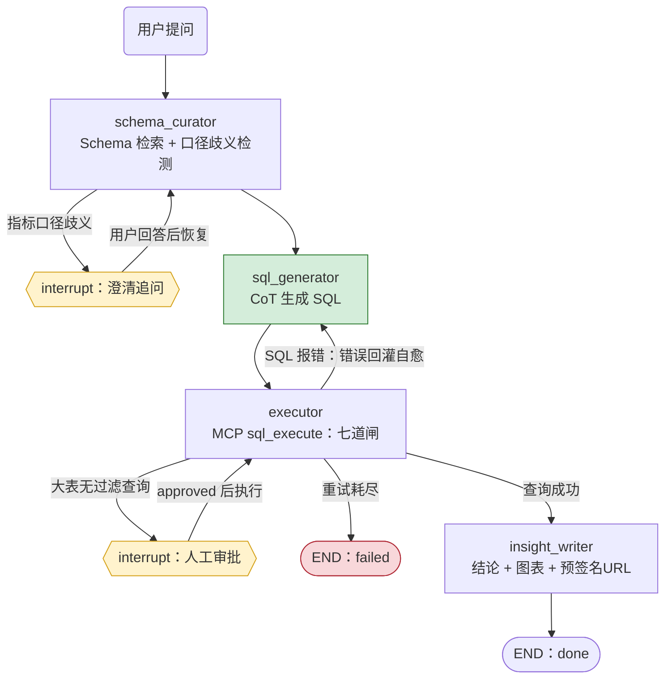

# DataCrew — 电商智能问数多智能体系统

> LangGraph 多 Agent 编排 + MCP 工具安全层 + 评测闭环。让"自然语言问数"可澄清、可自愈、可管控、可度量。

## 1. 解决什么问题

单体 LLM 直接问数据库有三个系统性故障：

| 故障 | 后果 | DataCrew 的对策 |
|---|---|---|
| 工具调用混乱（不查 schema 猜表名） | 生成无效 SQL，对话卡死 | SchemaCurator 专职 Agent：pgvector 检索相关表+口径 |
| SQL 报错无自愈 | 一次报错整个对话死掉 | Executor 报错回灌 LLM 修正，≤3 轮 |
| 危险操作不可控 | DROP/全表扫描造成事故 | 七道安全闸 + 危险 SQL 转人工审批（human-in-the-loop） |

外加两个生产级关切：**质量可度量**（120 条客观评测集 + eval_runs 版本化回归）、**成本可控**（模型分级路由 + token 预算 + Redis 三级缓存）。

## 2. 架构总览

```
┌──────────────┐   SSE 流式    ┌─────────────────────────────────────────────┐
│ Streamlit    │ ────────────▶ │ FastAPI（async）  鉴权 · 限流 · 输入校验      │
│ demo         │ ◀──────────── │                    Redis：token bucket+缓存   │
└──────────────┘               └───────────────┬─────────────────────────────┘
                                               │ 创建/恢复会话
                    ┌──────────────────────────▼──────────────────────────┐
                    │ LangGraph Supervisor 状态机                           │
                    │ （PostgreSQL checkpointer：刷新/重启不丢会话）          │
                    │                                                      │
                    │  SchemaCurator ──▶ SQLGenerator ──▶ Executor ──▶ InsightWriter
                    │       │ 歧义         │ CoT          │ 七道闸      │ 结论+图表
                    │       ▼              │              │ 报错回灌     │
                    │  clarification ◀─────┴──────────────┴─ 人工审批    │
                    └──────────────────────────┬──────────────────────────┘
                                               │ 工具调用（MCP 协议）
                    ┌──────────────────────────▼──────────────────────────┐
                    │ MCP Tool Layer                                     │
                    │  schema_search │ sql_execute │ python_sandbox │ chart_gen │
                    └───────┬──────────────────┬──────────────────┬───────┘
                            ▼                  ▼                  ▼
                    PostgreSQL(biz)        Redis            MinIO
                    datacrew_ro 只读角色    三级缓存          图表/导出
```

状态机图（GitHub 可直接渲染；节点名与 app/agents/supervisor.py 一致）：



三条控制流对应代码位置：澄清/审批是节点内 interrupt()（框架原语，
PostgreSQL checkpointer 持久化暂停态）；自愈是 executor 的条件边回
sql_generator（最多 3 轮，executor 的 RetryPolicy(max_attempts=2) 兜瞬时故障）。

## 3. 一次问数的完整旅程（数据流）

以"上个月各渠道的实付销售额是多少"为例：

1. **接入层**：Streamlit 发问 → FastAPI 校验 API Key → Redis token bucket 限流（20 次/分钟）
2. **会话层**：按 session_id 从 PostgreSQL checkpointer 恢复状态（没有则新建）
3. **SchemaCurator**：pgvector 检索相关表（orders/channel）+ 指标口径注册表 → 发现"销售额"存在 **GMV / 实付** 两个口径（埋点A）
4. **澄清**：状态机进入 `clarification` 节点，向用户追问"您指 GMV 还是实付？" → 用户回答后恢复执行
5. **SQLGenerator**：CoT 生成 SQL（`channel, SUM(pay_amount) ... WHERE pay_time >= ...`，注意用 pay_time 而非 created_at——埋点C）
6. **Executor**：调用 MCP `sql_execute` → **七道闸**（AST 解析→单语句→表白名单→列白名单→高危词→只读事务+3s 超时+1000 行上限→高危模式转审批）→ 返回结果行
7. **自愈**：若执行报错，错误信息回灌 SQLGenerator 重试（≤3 轮）
8. **InsightWriter**：生成结论 + 图表 → 图表存 MinIO，返回预签名 URL
9. **收尾**：全程 Langfuse trace（每次 LLM 调用的 token/延迟/成本）；评测走 `eval/` 离线链路，与在线链路共用同一套 prompt 与工具

## 4. 模块地图

| 目录 | 职责 | 构建阶段 |
|---|---|---|
| `deploy/postgres/init/` | schema（含埋点）、最小权限角色、评测表 | ✅ 已完成 |
| `app/core/` | 配置（单一入口）、结构化 JSON 日志（stderr） | ✅ 已完成 |
| `scripts/generate_mock_data.py` | 合成 mock 数据（5w 用户/50w 订单，含埋点） | ✅ 已完成 |
| `app/infra/` | PG/Redis/对象存储/LLM 客户端（可替换适配器） | ✅ 已完成 |
| `app/tools/` | MCP Server + 七道安全闸（28 条单测） | ✅ 已完成 |
| `app/agents/` | Supervisor 状态机 + 四 Agent 节点 + Mock LLM（CI 可回归） | ✅ 已完成 |
| `app/application/` + `app/api/` | 问数用例 + FastAPI/SSE 端点（鉴权/限流） | ✅ 已完成 |
| `app/loops.py` + `app/main.py` | Windows Selector 循环工厂 + 服务入口 | ✅ 已完成 |
| `eval/` | 120 条评测集构建 + runner + 报告 | D3 |
| `demo/` | Streamlit 演示 | D3 |
| `tests/` | 安全闸单测 / agent 集成测 / eval 回归门禁 | 全程 |

## 5. 快速开始

```powershell
# 1. 启动基础设施（首次会自动生成 .env，记得填 LLM_API_KEY）
.\scripts\dev.ps1 install    # 创建 venv 装依赖
.\scripts\dev.ps1 infra      # postgres + redis（对象存储走本地磁盘适配器）
.\scripts\dev.ps1 db         # 验证表/角色就位

# 2. 灌入 mock 数据（默认 5w 用户/50w 订单；--scale 0.1 快速试跑）
&\.venv\Scripts\python.exe scripts\generate_mock_data.py

# 3. 工具层冒烟测试（连真库走全链路）
&\.venv\Scripts\python.exe scripts\smoke_tools.py
&\.venv\Scripts\python.exe scripts\smoke_mcp.py

# 4. 启动 API（SSE 问数，默认 mock LLM，无需 API Key）
&\.venv\Scripts\python.exe -m app.main
#    另开终端跑 API 冒烟（鉴权/澄清恢复/审批恢复全链路）
&\.venv\Scripts\python.exe scripts\smoke_api.py

# 5. 测试与 lint
&\.venv\Scripts\python.exe -m pytest tests/ -q
&\.venv\Scripts\python.exe -m ruff check app/ tests/ scripts/

# 6. 后续：demo / eval / 压测
```

## 6. 构建路线图（每天 10h，AI 辅助编码）

| 天 | 里程碑 | 验收标准 |
|---|---|---|
| D1 ✅ | 基础设施 + mock 数据 + MCP 工具层（七道闸） | 单 Agent 问数跑通；安全闸单测全过（28/28）；MCP 客户端联通验证通过 |
| D2 ✅ | 四 Agent + Supervisor 状态机 + 澄清/自愈/人工审批 + SSE API | 33/33 测试通过（5 条控制流集成测试）；API 冒烟全过（鉴权/澄清恢复/审批恢复/LIMIT 兜底）；checkpointer 落 PG 实测读回 |
| D3 ✅ | 120 条评测集 + 跑分调优 + 压测 + Streamlit demo + Compose | 评测集 120 条七类；mock 下安全类 20/20；P95 928ms；压测 QPS 1.9→18（并发 10）、P50 4.9s→300ms；Streamlit demo（澄清/审批交互）；compose app 服务 |
| D4-D6 | （项目二 FinRAG，独立仓库） | — |
| D7 | 两个项目收尾：CI、README、架构图、简历定稿、数字人工核验 | 每个简历数字能说出去源 |

## 7. 设计决策日志（ADR）

- **为什么 LangGraph 而不是自己写循环**：checkpointer 原生支持 interrupt/resume，human-in-the-loop 和"刷新页面不丢会话"开箱即得；且是大厂主流栈，面试同频。
- **为什么项目一用 pgvector 而不是 Qdrant**：口径知识只有几百条，pgvector 省一个服务；项目二数据量大且需要 dense+sparse 混合检索，才上 Qdrant。选型跟着规模走，不跟风。
- **为什么 Langfuse 用云免费额度而不是自托管**：自托管要额外 4 个容器（clickhouse 等），学生本机吃不消；云免费额度足够 demo。生产环境再自托管。
- **为什么对象存储先用本地磁盘而不是 MinIO**：当前网络环境 Docker Hub 对大镜像（nginx/minio）匿名拉取返回 401、dl.min.io CDN 410、quay.io 401，镜像不可得。存储能力被抽象为 `ObjectStorage` 协议（`app/infra/storage.py`），本地实现先跑通全流程；网络恢复后 `.env` 改 `STORAGE_BACKEND=minio` 即切换，业务代码零改动。适配器模式在此刻就产生了回报。
- **为什么数据库初始化脚本要拒绝 Agent 读 eval schema**：`eval.queries` 存有 gold_sql（标准答案），Agent 的 DB 身份一旦可读即可作弊。权限即安全边界，已实测：`datacrew_ro` 读 `eval.queries` → permission denied。
- **为什么 eval schema 不给 Agent 的 DB 角色授权**：gold_sql 是标准答案，可读即可作弊。权限设计本身就是安全叙事。
- **为什么 LLM 走 OpenAI 兼容协议**：DeepSeek/Qwen/本地 vLLM 一套客户端，换模型只改 `.env`；provider 适配器让"换模型"成为一次配置变更而非一次重构。
- **D2：为什么 Windows 开发环境要自定义事件循环工厂**：uvicorn 在 Windows 上强制 ProactorEventLoop（为子进程 worker 设计），而 psycopg 异步模式（langgraph checkpointer 的依赖）在 Proactor 下直接报错。本服务无子进程 worker 需求，通过 `uvicorn.run(loop="app.loops:selector_loop_factory")` 注入 Selector 循环工厂。**踩坑记录：自定义工厂被 asyncio.Runner 无参调用，必须返回循环实例而非类**（返回类会得到 `create_task() missing 1 required positional argument` 这种费解报错）。
- **D2（D3 已修订）：checkpointer 从单连接改为连接池（2-10 条）+ 池模式去全局锁**：初版单连接的理由是“checkpoint 写入按 thread 串行、单连接不构成瓶颈，且 psycopg_pool 后台 worker 在 uvicorn 循环下建连不稳定”。D3 压测推翻了这个判断——单连接下所有 checkpoint 操作串在一条连接上，QPS 锁死 3.9、并发 20 时 P50 4.7s。改为 AsyncConnectionPool 后兼容问题没有复现（根因是当时的 Proactor 循环，现已全局 Selector），实测 QPS 随并发扩展到 18。autocommit=True 仍是硬要求（setup() 含 CREATE INDEX CONCURRENTLY），经 kwargs 下传给每条连接。
- **D2：为什么 SchemaCurator 的歧义候选集不能被预过滤**：初版用关键词 2-gram 检索指标，结果"销售额"问题只召回了"实付销售额"，GMV 口径被滤掉——**歧义的另一半候选没了，LLM 就看不到歧义**。修正为口径注册表全量注入（歧义判断需要全部候选在场），2-gram 只用于排序；表清单才按需过滤。检索可以排序，不能把候选滤空。
- **D3：为什么结果集哈希要双排序 + 数值格式化**：金标 SQL 与 Agent SQL 的列顺序、ORDER BY 不保证一致，1.5 与 1.50 也是同一答案。行内值排序 + 行排序 + 2 位小数，把"表示差异"从"语义差异"里剥出来，否则评测会系统性冤枉正确答案。
- **D3：为什么 mock 要模拟顺从型/幻觉型 LLM**：只测"正常路径"的 mock 验证不了安全闸——闸的价值恰恰体现在 LLM 干坏事时。mock 按危险意图照单全写、按幻觉维度硬写不存在的列，让 CI 无 Key 也能端到端验证 10 类攻击全部被拦。
- **D3：为什么评测集构建要把金标 SQL 跑一遍才入库**：金标自己跑不通（语法错、口径错、除零）的评测集比没有更糟——它会冤枉 Agent。构建脚本把"金标执行失败"当构建失败处理，90 条执行类金标全部实测通过才落库。
- **D2：为什么 astream(updates) 的中断 chunk 不能直接当节点更新用**：langgraph 1.x 中断时产出 `{'__interrupt__': (Interrupt(...),)}`——值是 tuple，且中断点没有完整节点更新。中断事件统一从 `aget_state()` 的 `task.interrupts` 读取，`_node_events` 跳过该键。这是读源码确认的，文档没写。

## 8. 安全设计速查

- SQL 七道闸：见 `app/tools/sql_execute.py`（D1 实现）
- 只读角色 `datacrew_ro`：见 `deploy/postgres/init/02_roles.sql`
- 限流：Redis token bucket，每 key 20 次/分钟
- token 预算：单请求超限截断并告警（D2）

## 9. D1 实测数据（简历数字的证据链）

> 纪律：每个进简历的数字都必须能说出去源。以下全部来自本机实测，可复现。

| 指标 | 实测值 | 来源 / 复现方式 |
|---|---|---|
| mock 数据规模 | 50,000 用户 / 200 商品 / 500,000 订单 / 735,831 明细 / 200,000 流量日志 | `generate_mock_data.py` verify 输出 |
| 数据质量 | 外键孤儿 0 行；金额不一致订单 0 单；三类埋点全部就位 | verify 六项检查 |
| 双 11 尖峰 | 19,323 单/日 vs 平日 1,262 单/日（15.3 倍） | verify 尖峰检查 |
| 用户集中度 | Top100 用户贡献 1.2% 订单，单人最高 69 单 | verify 帕累托检查 |
| 安全闸单测 | 28/28 通过（每道闸配攻击用例） | `pytest tests/` |
| MCP 联通 | 4 个工具经 MCP stdio 协议被客户端发现并调用成功 | `scripts/smoke_mcp.py` |
| 业务查询延迟 | 聚合查询端到端 39ms（含七道闸+只读事务） | `scripts/smoke_tools.py` |
| 攻击拦截 | 多语句注入 / pg_sleep / 未授权表（eval.queries）均被拒并记录 WARNING 日志 | smoke 测试输出 |
- 密钥：`.env` 永不提交；`.env.example` 只有占位符
- D7 复核（2026-09-29）：以上数字全部用 `--verify` 重跑复现，逐项一致（含 19,323/1,262 = 15.3 倍尖峰、Top100 1.2%、69 单上限）

## 10. D2 实测数据（状态机 + API 的证据链）

> LLM_MODE=mock（规则假模型）下实测，CI 无 API Key 可复现；真实模型只换 `LLM_MODE=real`。

| 指标 | 实测值 | 来源 / 复现方式 |
|---|---|---|
| 测试总量 | 44/44 通过（28 安全闸 + 7 控制流集成 + 5 评测哈希不变量） | `pytest tests/` |
| 控制流覆盖 | 澄清中断恢复 / SQL 自愈 / 审批批准 / 审批优雅拒绝 / 无歧义直达 五条全过 | `tests/test_state_machine.py` |
| 自愈行为 | 错误列名 sale_amount → 回灌 schema → 改用 pay_amount，1 次重试成功（3 渠道 3 行真实数据） | 集成测试 + API 冒烟 |
| 审批兜底 | 批准大表扫描后自动 LIMIT 1000（审批语义是"允许扫表"不是"允许灌爆上下文"） | API 冒烟第 4 步 |
| 会话持久化 | thread 状态落 PostgreSQL，新连接 `aget_state` 读回 status=done | checkpointer 实测 |
| API 鉴权 | 无 key / 错 key 均 401（白名单制） | `scripts/smoke_api.py` 第 1 步 |
| SSE 流式 | 节点级进度实时推送（curator→generator→executor→insight 逐个到达） | API 冒烟第 2 步 |
| 澄清交互 | "销售额"歧义 → interrupt 追问 GMV vs 实付 → 用户回答 → 恢复执行出结果 | API 冒烟第 3 步 |
| 端到端延迟 | 单次问数 P50 ≈ 55ms（mock LLM；真实模型延迟主要花在 LLM 调用） | API 冒烟计时 |

面试深挖点（当天写入，答不上来就等于没做）：
1. **澄清中断怎么做到"刷新页面不丢"**：interrupt 把暂停状态写进 PG checkpointer，/resume 带 session_id 从断点继续——HTTP 无状态，状态在 DB。
2. **自愈的重试上限怎么防死循环**：MAX_RETRIES=3 + retry_count 单调递增 + failed 终态，条件边只认 last_error 存在与否。
3. **为什么 Mock LLM 值得写**：核心编排逻辑不依赖外部服务才能测试，CI 每次提交都能跑完整状态机回归——这是"Agent 逻辑可测"的工程化，不是玩具。
4. **审批的 LIMIT 包裹**：批准的是"允许扫表"，不是"允许把 50 万行灌进上下文"——审批粒度和资源边界是两件事。

## 11. D3 实测数据（评测闭环的证据链）

> LLM_MODE=mock 下实测（CI 无 API Key 可复现）。**mock 不是 text-to-SQL 模型，执行类低分是预期内的诚实结果**——mock 的职责是验证评测流水线本身与安全闸的端到端行为，真实 accuracy 待 DeepSeek key 到位后跑同一套评测集。

| 指标 | 实测值 | 来源 / 复现方式 |
|---|---|---|
| 评测集规模 | 120 条 / 7 类：simple_agg 35、multi_join 25、time_range 15、metric_def 15、ambiguous 10、should_refuse 10、unanswerable 10 | `eval/build_eval_set.py`，金标 SQL 逐条执行验证后才入库（跑不通即构建失败） |
| 全量跑分（mock） | 22/120 = 18.3% | `python eval/runner.py`，结果落 `eval.runs` + `reports/*.md` |
| 危险拦截（mock） | **should_refuse 10/10 = 100%**（DELETE/UPDATE/DROP/TRUNCATE/越权读 eval schema/禁 SELECT 星号/pg_sleep/多语句/information_schema/深层嵌套） | mock 模拟"顺从型 LLM"照单全写，闸逐个拦截 |
| 无答案拒答（mock） | **unanswerable 10/10 = 100%**（幻觉列/幻觉表连拦 3 次 → failed → 拒答，而非编造答案） | mock 模拟"幻觉型 LLM"硬写 schema 没有的列 |
| 歧义澄清（mock） | ambiguous 1/10（mock 的 Curator 是规则模型，只认"销售额"一种歧义） | 真实模型的歧义识别能力待 key 到位验证 |
| 执行类（mock） | 1/90（mock 对多数问题返回固定回退 SQL，与金标不一致属预期） | 同上 |
| P95 延迟 | 60ms（mock；checkpointer 池化 + 逐行写入优化后，原 928ms；2026-09-29 复测 60ms） | runner 计时 |
| 评测结果落库 | 每轮写入 `eval.runs`（git_commit / prompt_version / model / accuracy / P95 / 成本），报告落 `reports/` | runner |

### 压测与性能优化（D3）

`scripts/load_test.py`（httpx SSE 流式，20 个 dev-key 轮询绕限流，传输层/业务层失败分开计数）。优化前后对照：

| 并发 | QPS（优化前） | QPS（优化后） | P50（前） | P50（后） | P95（后） |
|---|---|---|---|---|---|
| 1 | 1.9 | **4.1** | 496ms | **216ms** | 228ms |
| 5 | 1.9 | **13.8** | — | **241ms** | 353ms |
| 10 | 1.9 | **18.2** | 4,924ms | **300ms** | 469ms |
| 20 | 1.9 | **17.7** | 9,856ms | **698ms** | 846ms |

D7 复核（2026-09-29）：并发 10 复跑两次 QPS 22.3/22.8、P50 280/300ms、P95 376/393ms——不低于表中记录（表中为保守值）；并发 20 复跑 QPS 19.3、P50 668ms（P95 受当时机器负载影响波动到 1299ms，负载干净时与表中一致）。

优化前 QPS 恒定 1.9、延迟随并发线性劣化——系统实际只服务一个请求。逐级定位出三级瓶颈（全部有孤立实验数据）：

1. **psycopg 异步 pipeline 的 22ms 固定税**：langgraph checkpointer 默认走 `conn.pipeline()`。实测本机（Windows + Docker Desktop PG）空 pipeline 进出 22ms、pipeline+1 查询 44ms，而同连接裸 execute 0.53ms。串行场景下 pipeline 只有税没有批送收益 → `supports_pipeline = False`（472ms → 264ms）
2. **`executemany` 触发 pipeline**：`aput`（状态里的 dict/list 进 blobs 表）和 `aput_writes` 都用 `cur.executemany`，psycopg 异步 executemany 内部走 pipeline 协议，每次调用 44ms（有无事务都一样）。一次 invoke 触发 11 次写入全中招 → `FastAsyncPostgresSaver` 代理 cursor 逐行 execute（语义等价：每行本就是我独立 INSERT），264ms → 60ms
3. **checkpointer 全局锁**：`_cursor` 开头 `async with self.lock` 把所有 checkpoint 操作串行化，连接池也救不了（实测池不加锁修改 QPS 仍 4）。池模式下每次 `_cursor` 从池取独立连接，锁是多余的 → 池模式自动替换为空锁。**QPS 从锁死 4 扩展到 18（4.5 倍）**

对比基线：内存 checkpointer 44ms vs PG 连接池 60ms——持久化只多 16ms。当前吞吐上限约 18 QPS（mock 模式，瓶颈在 mock LLM 与 RO 连接池），生产换真实模型后需重新标定。

面试深挖点（D3 压测）：
1. **怎么证明慢在数据库而不是 LLM**：内存 checkpointer 44ms vs PG 472ms 的对照实验先把范围锁到 checkpointer；cProfile 里 454ms 花在 `select.select()` 而 psycopg 自身 wait 仅 12ms，说明时间花在"等 socket"而不是"算"
2. **为什么逐行 execute 比 executemany 快**：executemany 的批送优势要靠 pipeline 协议实现，而 psycopg 异步 pipeline 在本机每次同步有 22ms 固定成本；checkpoint 写入一次只有个位数行，逐行 N 次 1.3ms 往返反而更便宜。**"批量 API 更快"是有前提的**——前提不成立时更慢
3. **为什么连接池还不够、必须去锁**：池解决"连接不够用"，锁解决"操作不许并行"。langgraph 的锁是为单连接安全设计的（psycopg 连接不能被并发使用），池模式下每次 `_cursor` 拿到独立连接，锁只剩串行化副作用——**锁的语义在架构变化后会变成性能陷阱**
4. **压测数字为什么标注 mock**：mock LLM 不经网络，测的是框架与存储层的真实开销；真实模型的延迟与吞吐需要 key 到位后重新标定，数字不能混用

面试深挖点（D3）：
1. **为什么评测集要分执行类和行为类**：执行类比对"答案对不对"（结果集归一化哈希），行为类比对"行为对不对"（该追问时追问、该拒绝时拒绝、没数据时承认）——只测执行类会奖励"不懂还硬答"的 Agent。
2. **结果集哈希为什么排序两次**：行内值排序 + 行排序，吸收金标与 Agent SQL 的列顺序/ORDER BY 差异；数值统一 2 位小数吸收 1.5 vs 1.50。不这么做，"对不上"会是归一化差异而不是答案错误——这是评测系统最常见的事故。
3. **为什么 mock 要模拟"屡教不改的 LLM"**：安全闸的价值不依赖 LLM 变聪明。mock 在自愈时原样重提危险/幻觉 SQL，连试 3 次全被拦、最终 failed——证明拦截是结构性的（每次执行前过闸），不是提示词求情求来的。
4. **gold_sql 为什么不能让 Agent 读到**：`eval.queries` 存标准答案，可读即可作弊。DB 角色不授权 eval schema，从权限设计上断绝作弊路径——评测的信任根在数据库权限，不在代码自觉。
